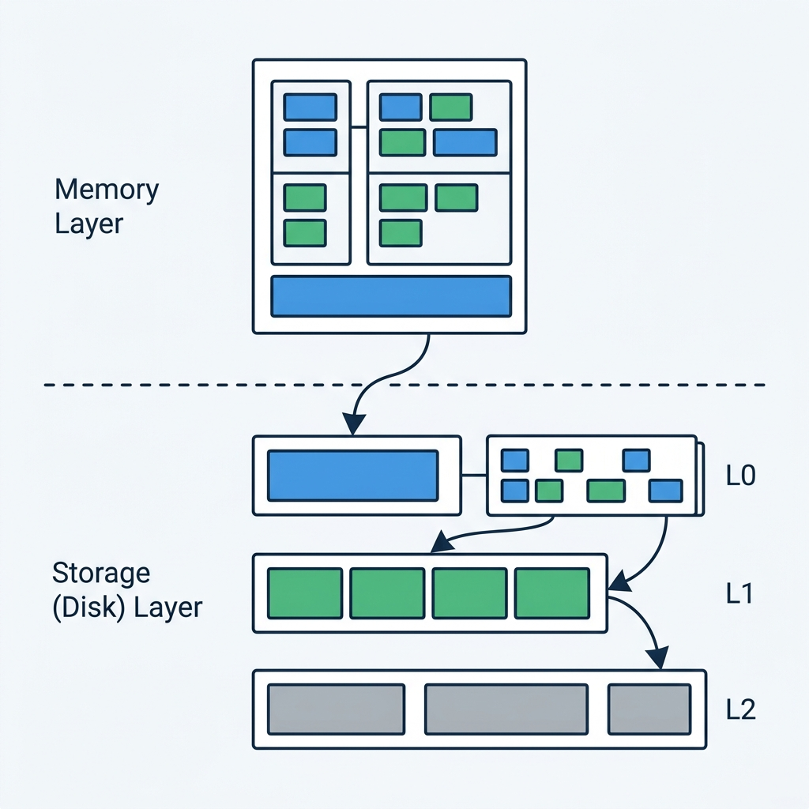
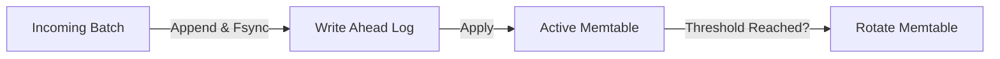
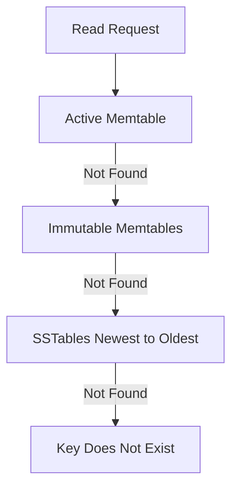

+++
date = '2026-05-29T01:47:21+01:00'
draft = true
title = 'Log Structured Merge Trees'
+++

# Building an LSM Tree in Go: Understanding the Moving Parts

 

Log-Structured Merge (LSM) Trees have become ubiquitous in today's database world. The name has become almost synonymous with modern storage engines. LSM trees sit behind databases like Cassandra, CockroachDB, RocksDB, LevelDB, and Pebble. 

One thing these systems have in common is their use in write-heavy workloads. The goal of an LSM is to ingest writes at a large scale, as quickly as possible. It sacrifices some read speed for this, because nothing is ever free. Even then, some optimizations can make that tradeoff manageable.

To truly understand how this works, I decided to build lsmgo - a small LSM Tree prototype written in Go for learning systems programming. The goal wasn't to build the next RocksDB. The goal was to understand the moving parts that make an LSM-style storage engine work.

In this post, I want to walk through the foundational building blocks I implemented: batch writes, the WAL (Write Ahead Log), the Memtable, and SSTable flushes. This is a dive into the internals of the data structures that power this technology.

---

## 1. Batch Writes: The Cost of Fsync

I consider batch writes to be one of the foundations of the entire system. A learning prototype doesn't *strictly* need batch writes, but I find them incredibly instructive because they clearly expose the limitation of the "one-write" approach.

Imagine the naive path for a write:
`one write = one WAL append + one memtable insert`

The problem is that each durable WAL append involves an `fsync`, and `fsync` is expensive. It forces the OS to flush its write buffers all the way to disk. On a typical NVMe drive, that might be around 100-200 microseconds per fsync. If you do that per key, your throughput ceiling becomes completely limited by the number of fsyncs you can perform, regardless of how fast everything else is.

Batching changes the math entirely. You take 10, 100, or 1000 key-value pairs, write them all to the WAL in one sequential append, do one `fsync`, then apply all of them to the memtable. The fsync cost is now amortized across the entire batch.

## 2. The Write Path and the WAL

The Write Ahead Log (WAL) is the guard against data loss. It exists to ensure durability.

When a batch comes in, the write goes through this order:



Before data goes into the memtable (the primary write location in memory), it *first* has to be persisted in the WAL. It may feel counter-intuitive to write to a slow disk before writing to fast DRAM. But this disk write is strictly sequential. The file grows at the end, streaming bytes forward. No random jumping around. This makes the write pattern much friendlier to disk.

If the server crashes just before adding the data to the memtable, the state can be recovered by replaying the WAL. It's a safety net that prevents the ambiguity of an interrupted write.

## 3. The Memtable: Memory vs. Disk Tradeoffs

The memtable is what makes writes (and some reads) quick. It's a data structure held in memory that temporarily holds recent writes before flushing them to SSTables.

In `lsmgo`, I used a **skip list** as the underlying data structure. 

Why not a map? Maps are strong for insertion and lookup, but they are unordered. When a memtable reaches its threshold and needs to be written to an SSTable on disk, the database needs sorted iteration over all keys. A hash map can't give you that without a full `O(n log n)` sort at flush time. The skip list maintains sorted order continuously as inserts happen, so flushing is just a linear scan.

LSMs do not do in-place updates. An update is just a newer write for the same key. A delete is a special tombstone marker, not an immediate removal. Newer writes simply shadow older writes. 

Because of this shadowing, read operations must respect a strict sequence, starting from the newest data:



The core LSM tradeoff is this: **accept pointer indirection in memory so disk writes can be sequential.**

## 4. SSTables & The Magic Number

When a memtable reaches its threshold, it's retired into an immutable queue. Eventually, it's flushed to disk as an **SSTable** (Sorted String Table).

Unlike the memtable, the SSTable is a durable file. This implementation writes a simple layout:
`[records][bloom filter][footer]`

One important lesson here was the use of a **magic number** in the footer. A database file is just bytes. Without a recognizable structure, we don't know if the file is complete, corrupt, or even the right type of file. The magic number validates the file format. If the expected signature is missing, it's safe to treat the file as invalid.

To optimize reads, we use **Bloom filters** per SSTable. Since reading from disk is expensive, the Bloom filter acts as a fast probabilistic check. It might give false positives, but it never gives false negatives. If the Bloom filter says a key isn't there, we don't have to scan the file. That is a small price to pay for reducing unnecessary disk scans.

## 5. The Manifest

Finally, the manifest is the durable list of SSTables that belong to the DB.

At first, it feels like writing an SSTable file should be enough. If `000001.sst` exists on disk, why does the DB need anything else? 

The OS directory can contain many files—some may be old, temporary, corrupt, or unrelated. The DB cannot just trust every file it sees. It needs a durable catalog. That catalog is the manifest.

For now, I kept the manifest deliberately simple and text-based:
```text
add 1 /tmp/db/sst/000001.sst
next 2
```
On startup, the DB replays the manifest to rebuild its in-memory SSTable list.

## Why Compaction Is Not Here Yet

You might notice something missing: Compaction. 

Compaction needs a durable way to say: "Remove old SSTables A & B, and add new compacted SSTable C." That means compaction entirely depends on having a robust manifest. For this milestone, I stopped after building the manifest foundation. A future compaction milestone will add the `remove` or `replace` manifest records.

## Final Thoughts

Building `lsmgo` has been an incredible exercise in systems programming. It’s one thing to read about how RocksDB or LevelDB works, but implementing the sequence numbers, tombstones, WAL framing, and skip list rotations really cements the concepts.

If you are interested in storage engines, I highly recommend building your own toy version. The tradeoff decisions you make will teach you more than any whitepaper could. The full breakdown of the project is available here: [github](https://github.com/franzego/lsmgo). Contibutions and suggestions are welcome.

GodSpeed, Franz
